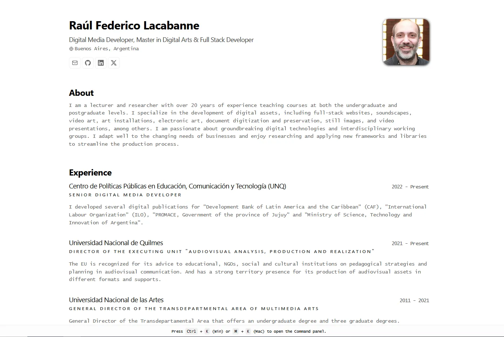

# Raúl Federico Lacabanne | Printable resume



# Printable resume

**Simple web app that renders minimalist resume with print-friendly layout.**

_Built with Astro, [JSON Resume Schema](https://jsonresume.org/schema/) and deployed on GitHub._

Based in Bartosz Jarock's design:
https://github.com/BartoszJarocki/cv

Adapted from midudev's version:
https://github.com/midudev/minimalist-portfolio-json

# Features

- Setup only takes a few minutes [single config file](./cv.json)
- Built using Astro 4 and Typescript
- TODO: Responsive for different devices
- Optimized for Astro and Vercel

# How to use it:

1. Clone this repository to your local machine:

   ```bash
   git clone https://github.com/knnv-ar/resume.git
   ```

2. Move to the cloned directory

   ```bash
   cd resume
   ```

3. Install dependencies:

   ```bash
   npm i
   ```

4. Start the local Server:

   ```bash
   npm run astro dev
   ```

5. Open the [JSON file](./cv.json) and make changes.